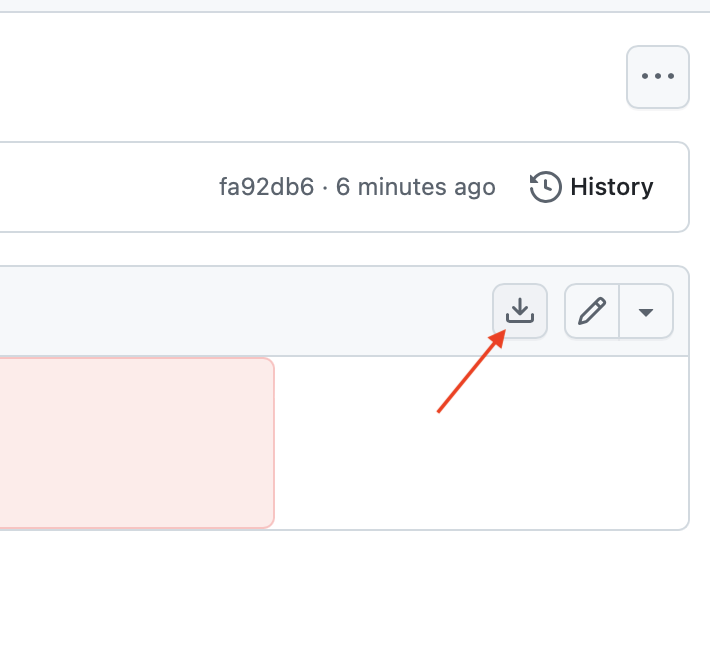

# Histologiekurs

Begleitendes Material für den freiwilligen Refresherkurs Histologie für Medizinstudenten, gehalten WS 2025/26 an der LMU. 

**Download**
Die entsprechende PDF-Datei () wird im Inhalt des Repositories gelistet. Auf die Datei klicken, anschließend über den Download-Button herunterladen (siehe Foto). Je nach Internetverbindung dauert es ein wenig bis der Download abgeschlossen ist. 

